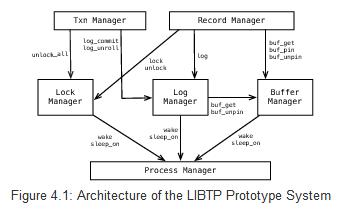
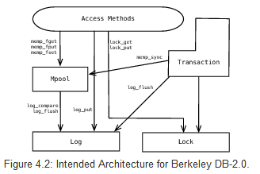
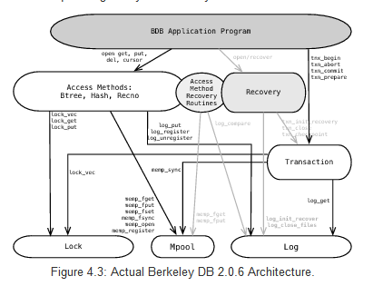
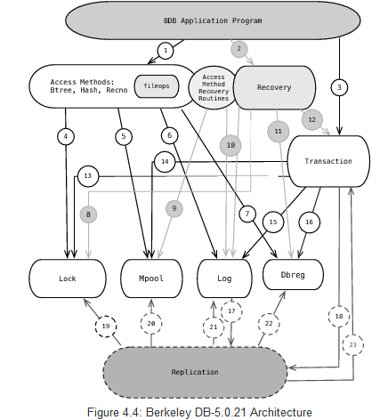
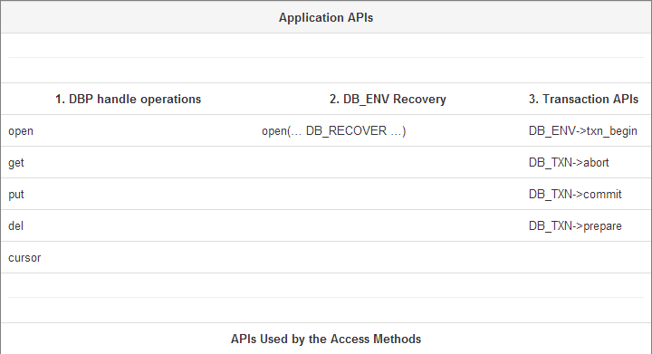
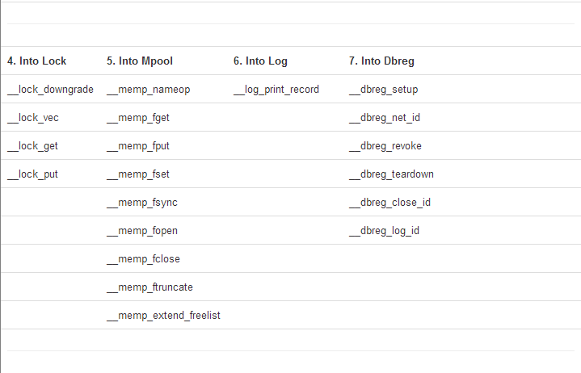
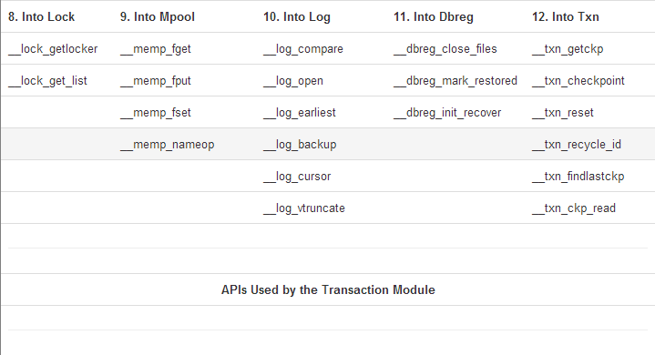
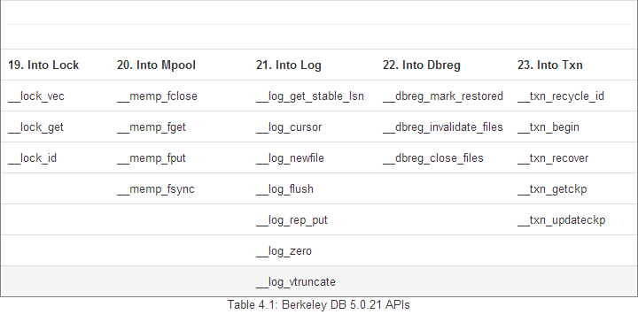
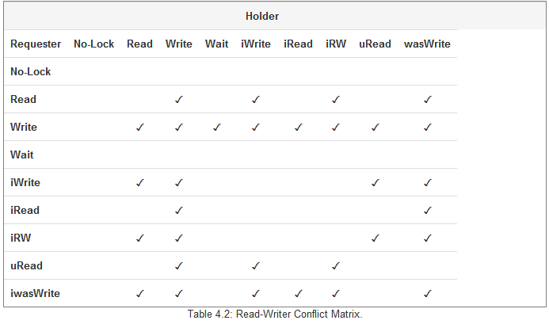

## Berkeley DB ##
Margo Seltzer and Keith Bostic  

康威定律说:"设计系统的组织，最终产生的设计等同于组织之内、之间的沟通结构。"。延伸一下，我们可以想象：初始由两个人设计的软件的架构，不仅仅反应了该组织间的结构，更反应了两个人之间的分歧与理念。我们两种的一个（Seltzer）的职业生涯都在从事文件系统和数据库管理系统。如果问她，她会说着两个东西从本质上讲其实是一回事。更进一步讲，操作系统和数据库管理系统本质上都是管理资源，并且提供抽象便捷的操作。它们的差异“仅仅”只是实现上的不同。另一个人（Bostic）则相信：基于工具的软件工程以及基于简单构件的组件架构。因为这样的系统在某些方面会比整体架构的系统要优秀的多--易理解性、可扩展性、可维护性、可测试性、灵活性。  

如果你结合两个观点，就不会惊讶于我们过去20年在Berkeley DB上的工作--一个软件库提供了快速，灵活，可靠并且可扩展的数据管理。Berkeley DB 提供了很多和传统系统一样的功能--人们期望的功能。比如，关系型数据库，但是，以不同的形式封装。比如，Berkeley DB访问数据很快，（key值访问和顺序访问），同样支持事务，崩溃恢复。但是，它是以库形式提供的，并且直接链接到应用程序中，而不是作为一个独立的应用服务。  

在本文中，我们会深入的剖析Berkeley DB（以下简称BDB），以及它的各个模块，每个模块都秉承了Unix的“do one thing well”的理念。内嵌了BDB应用可以直接使用这些组件，或者通过类似于get,put,delete数据项的操作来隐式的使用它们。我们关注于架构--我们如何开始，我们设计了什么，我们在哪结束，以及为什么。这些设计必须是（并且肯定是）可以适应和改变--随着时间的推移，重要的是维护原则以及一致性视角。我们也会简要的阐述一个长期软件项目的代码演变过程。BDB已经经过20年的持续开发，毫无疑问，这归功于一个优秀的设计。  

**1. In the Beginning**  
BDB可以追溯到Unix操作系统还是专属于AT&T的时代，数以百计的工具和库都有严格的许可限制。Margo Seltzer是California，Berkeley大学的毕业生， Keith Bostic是Berkeley计算机系统研究组的成员。那时候，keith真正致力于从Berkeley软件发行版上移除AT&T的软件。  

BDB项目开始的的目标是要替换 内存中hsearch hash package以及 磁盘上的dbm/ndbm hash package。使用一种新型改进的hash方法，可以应用于内存中和磁盘上。同时也是一个没有专属许可的自由发行版。Margo Seltzer写的这个hash库[SY91]是基于Litwin的《可扩展线性hash研究》。它使用一个很灵巧的方法使得能在固定时间内将hash值映射到数据页地址，同样可以处理大数据---数据项大于承载其的hash桶或者文件系统的页大小（通常是4到8个KB）。  

If hash tables were good, then Btrees and hash tables would be better（没看懂）。Mike Olson 同样是一名Berkeley大学的毕业生，之前写了很多BTree的实现，并且同意再写一个。我们中的三个将Margo的hash代码和Mike的转换成通用访问接口的API，应用通过此接口来操作数据库提供的hash或者BTree访问方法，继而来读取和修改数据。  

构建在这两种访问方式之上，Mike Olson 和 Margo Seltzer写了一篇论文 [SO92]，里面阐述了LIBTP，一种可以运行在应用程序地址空间的编程式事务型库。  

这个Hash和BTree库最终合入了4BSD的release版本中，并命名为Berkeley DB 1.85。技术上来讲，Btree访问方式是用B+link tree实现的，然而，在本文的接下来都会用BTree来指代。BDB 1.85的结构和API对于使用Linux或者基于BSD系统的人来说十分熟悉。  

BDB1.85库稳定了好几年，知道1996年，Netscape 签约了Margo Seltzer和Keith Bostic来构建出LIBTP论文中描述的完整事务系统。并且创建一个生产级别的软件版本。他们努力的结果就是BDB的第一个事务型版本，BDB2.0。  

BDB后来的历史就较为简单和传统了：BDB 2.0（1997）引入事务，DBD 3.0（1999）重新设计架构，添加了抽象层和间接的适应了不断增长的功能需求。BDB 4.0（2001）引入了备份和高可用性，以及Oracle BDB 5.0（2010）添加了SQL支持。  

在写这篇文章的时候，BDB已经是世界上使用最为广泛的数据库工具包了。数以百万计的拷贝运行在各种系统上，从路由，浏览器到邮箱和操作系统。经管已经过了20年，BDB的基于工具和面向对象的架构，使得它仍然可以继续改进以及自我重构来适应使用它的软件需求。  

**Design Lesson 1**  
对于任何一个复杂软件的测试和维护极为重要的是，软件在设计和构建时，就得设计成一系列模块的组合，并且定义好的API界限。这个界限可以（并且必须）根据需要改变，但是仍然需要这些界限。这些界限的存在，使得软件避免称为一堆不可维护的意大利面条。 Butler Lampson曾经说过，计算机科学中的所有问题可以通过另一种间接的层面解决。更为重要的是，当被问到面向对象意味着什么时，Lampson说，这意味着在一个API的背后你可以使用多种实现。BDB的设计和实现秉承了这一原则，在通用接口的之后运行多样的实现。提供面向对象的视角和感受，即使这些库是用C写的。  

**2. Architectural Overview**  
在本章节中，我们会回顾BDB库的架构，从LIBTP开始，讨论它的一些关键方面演进。  

图4.1，取自于 Seltzer 和 Olson的论文中，描述了原来的LIBTP架构，图4.2 描述了BDB2.0 的设计架构。  
  

LIBTP的实现和BDB 2.0的设计最大的不同就是移除了process manager。LIBTP要求各个控制线程注册自己，并同步于那些单独的线程/进程，而不是提供一个子系统级的同步。正如第4节讨论的，原始的设计可能更适用于我们。  

  

在设计和实际发布的db—2.0.6的架构（如图4.3）的不同之处在于，对于恢复模块的实现。图中灰色的部分就是恢复子系统。恢复模块包括了，驱动设备（图中的那个recovery方框）和一系列的redo,undo例程来恢复那些通过AM（access methond 访问接口）执行的操作。在架构图中就是那个标上“access method recovery routines”的圈。在BDB2.0中对于如何处理恢复是一致性设计，相对的LIBTB针对不同的访问接口使用不同的日志记录和恢复例程。这种通用的设计原则同样催生了不同模块间的丰富的接口。  

图4.4 描述了BDB-5.0.21的架构。该图所涉及到API列在表4.1中。尽管原来的架构仍然清晰可见，现在的架构添加了新的模块，分解了老的模块（比如，log变成了log和dbreg）,以及在模块间的API的数量上有很大的增加。  

经过十年的演讲，众多商用版本的发布，以及后续的数以百计的新特性，我们可以看到当前的架构比原来的复杂了好多。这边需要注意的是：首先，replication在系统中添加了一层，但是它处理的很干净，和原来的老代码一样，使用相同的接口和系统的其余模块交互。其次，log模块分裂成log和dbreg（数据库注册）。这在第8节会详细讨论。最后，我们将所有的内部模块调用放到命名空间中，并开头用下划线标识，这样应用就不会和我们的函数名冲突了。我们将会在 Design Lesson 6详细讨论。 

第四， 日志子系统的API目前是基于游标的（去除了log_get API,替换成了log_cursor API)。在历史上，BDB在任意时刻都不会有超过一个线程来读写日志，所以该库中有一个指向当前日志的指针。这不是一个很好的抽象，如果带上replication 就没法工作了。正如应用API使用游标支持迭代器，日志目前使用游标来迭代。第五，fileop模块内含的访问接口提供了事务性从保证了数据库的create,delete,rename操作。我们尝试多种方案来优雅的实现它（它仍没有我想象中那么干净），在对它重构了很长一段时间后，我们将它从模块中抽离出来。

**Design Lesson 2**
软件设计是几种能让你尝试解决问题之前对其完整思考的方法之一。有经验的程序员会采用一些不同的技巧来完成设计：有些人会写出一个版本，然后丢弃它，有些人会写一些使用手册或者设计文档，others fill out a code template where every requirement is identified and assigned to a specific function or comment. 比如，对于BDB，在写代码之前，我们创建了一系列的Unix-style的使用手册，关于访问接口和组件。无论使用哪种技术，在调试代码之前，很难考虑清楚程序的架构到底是什么样的，更不用说，当架构发生大的变更时，之前的调试工作就白费了。Software architecture requires a different mind set from debugging code, and the architecture you have when you begin debugging is usually the architecture you'll deliver in that release. 

为何将事务库从组件中抽离出来，而不是像当初那样作为单一的用途？对于此问题有三种解释：  
1、它迫使一个更为严谨的设计。  
2、如果代码中没有较强的边界，软件包将欲将复杂最后沦为一坨意大利面条。  
3、你无法预料到所有用户的使用行为，如果你让用户可以访问软件组件，他们会用你从没想到的方式使用他们。  
在下面的章节，我们会讨论BDB的每一个组件，了解这个组件是做什么的，并在整个架构中如何发挥作用的。  

**3. The Access Methods: Btree, Hash, Recno, Queue**  
BDB的访问接口提供key值查找，迭代访问，变长和定长字节串。BTree和Hash支持变长key/value对。Recno和Queue支持记录号/值 对（Recno支持变长数据，Queue只支持定长数据）。  

Btree AM和Hash AM 最大的不同就是BTree支持key的局部引用，hash并不支持。这意味着，Btree成为访问数据集的首选，然而，Hash AM适用于数据集大到BTree索引都无法装入内存的情况。此时，将数据加载到内存就比加载索引到内存要好。在1990年，这种折衷意义很大，当时内存比现在要小的多。  

Recno和Queue的不同在于，Queue支持记录级的锁，代价就是只能支持定长数据。Recno支持变长对象，和Btree，Hash，一样，只支持页级锁。  

我们之前是如此设计BDB的：CRUD（create，read，update，delete）是基于key的，并且作为应用程序的首选。我们后续添加游标来支持迭代。我们这做导致库中有很多混乱的无用的重复的代码。随着时间推移，这变的越来越不可维护，然后我们将所有的key操作都变成游标操作（现在对key操作分配了一个缓存游标，执行操作，然后将游标归还给游标缓存池）。这是软件开发中的一个重述过无数次的规则：不要以任何会影响清晰性和简洁性的方式来优化代码，除非你确定必须要这么做。  

**Design Lesson 3**  
Software architecture does not age gracefully。软件架构的降级和对软件的修改量成正比：bug fixes corrode the layering and new features stress design。很难去判断当软件架构哦降级到何种程度，你就需要重新设计或者重写。一方面，随着架构的降级，维护和开发将变的越来越困难，结果就是对于这块遗留代码，每次发布的时候，都需要一堆人对其无脑测试，因为没人了解其内部是如何工作的。在另一个方面，用户会抱怨由于底层的变更所带来的不稳定性和不兼容性。作为一个软件架构师，你只能确保一件事：无论你怎么做，总会有人会抱怨你。  

我们没有详细讨论BDB AM的详细实现，他们是用耳熟能详的BTree和Hash算法实现的（Recno是在Btree加了一层，而Queue实现了一个文件块查找功能，复杂在增加了记录锁功能）  

**4. The Library Interface Layer**  
随着时间的推移，在添加功能的时候，我们发现应用和内部代码都需要统一的顶层功能（比如，一个表join的操作，需要多个游标来遍历记录，同样，应用也需要游标来遍历记录）  

**Design Lesson 4**
如何命名你的遍历，接口，函数或者注释和代码风格都不重要。因为有大把好的风格可选。重要的是，命名和代码风格必须一致。有经验的程序员可以从代码风格和对象命名中获取很多信息。You should view naming and style inconsistencies as some programmers investing time and effort to lie to the other programmers, and vice versa. Failing to follow house coding conventions is a firing offense. 

因此，我们将几个访问接口API分解成几层。这些接口层执行了所有必要的错误检测，函数检测，接口跟踪，以及其他一些动作：比如自动事务管理。当应用调用BDB是，我们首先调用基于这些对象的接口例程。（比如，__dbc_put_pp，就是调用BDB游标“put”（用来更新数据）的接口调用）。我们用"_pp"后缀来定义那些应用可以调用的接口。  

接口层中有一项工作就是跟踪BDB中有哪些执行线程。这很重要，因为BDB中有些操作只有在没有执行线程时才可以执行。BDB对每个开始执行的线程打上标记，并在执行调用返回后清除标记。进入/退出检测通常在接口层执行，同样可以检测该调用是否要在一个复本中执行。  

一个明显的问题是“为何不把一个线程标识传到库中，这样不会更简单么？”，回答是"yes",这样做会更为简单，而且我们也希望我们能这么做。但这样的话，就需要改变每个使用BDB的应用，几乎对BDB所有应用层调用，很多情况下，需要对应用程序重新设计。  

**Design Lesson 5**
系统架构师需要谨慎的考虑升级部分：升级到新的版本，用户可以接受次要的变更。（如果你能保证编译时错误，也就是说，升级完成后能有明显的错误，更新之后不能因为某些情况而导致崩溃）。但是要进行一次根本上的变更，你的架构必须允许新的代码，并且对你的用户群要留一个接口。显然，新代码和应用接口需要花费很多精力，但是就可以告诉用户这次大的变更是一次次要的变更，就不会惹怒你的用户群了。  

在接口层的另一个任务是事务处理。BDB提供一种模式：执行每个操作都会自动生成事务（这就省去了应用得创建和提交其显式事务的工作）。为了支持这一模型，每个通过该API的调用都会自动生成事务（如果没有明确指明其事务的话）。  

最后，所有的BDB AIP都需要检测参数。在BDB中有两类错误检测--通用检测来判断前一个操作的时候数据库是否崩溃了，或者我们是否正处于复制状态变更期（比如，改变复制器使之能写）。通用需要对某些API做特殊校验：flag使用，parameter 使用，option使用，以及在对请求的操作确切执行时的其他校验。  

对于API的校验函数都以“_arg”后缀。因此对于游标"put"的错误校验是在函数"__dbc_put_arg"中，由"__dbc_put_pp"函数调用。  

最后，当所有的参数校验以及事务生成都完成了，我们调用worker方法来执行实际的动作。（在我们的例子中，就是__dbc_put）。在我们内部调用游标put函数时也是用这个函数。  

This decomposition evolved during a period of intense activity, when we were determining precisely what actions we needed to take when working in replicated environments。在遍历了无数次代码库后，我们将所有的检测都抽离出来，这样下次有问题的时候，可以很容易的进行修改。

**5. The Underlying Components**
有四个组件来访问接口：缓存组件，锁管理组件，日志组件，事务组件。我们接下来会分别讨论他们，但是他们仍有一些通用的架构设计。  

首先，所有的子系统都有其自己特有的API，并且，最初每个子系统都用自己的对象的句柄，所有对于该子系统的调用方法都基于此句柄。例如：你可以使用BDB的锁组件来处理你自己的锁，或者编写自己的远程锁组件。或者你可以使用BDB的缓存组件来处理你自己的在内存中的文件页。随着时间的推移，特定子系统的句柄从API中移除了，从而简便了基于BDB的应用。虽然子系统仍然作为独立组件，并独立于其他子系统使用，现在他们使用一个通用的对象句柄（“DB_ENV” 环境变量句柄）。这种架构促使了分层和泛化。尽管，分层随着时间移来移去，仍然有一些地方，一个子系统会跨越到另一个子系统，对于程序员来说这是一个很好的规则：将系统的某些部分作为独立的软件来考虑。  

第二，所有的子系统（实际上，所有的BDB函数）对于其调用都会返回一个错误码。作为一个库。BDB不能进入到应用的命名空间来定义一个全局变量，更不用说，所有的错误都从一个条路径返回给调用栈，这是一条很好的编程规则。  

**Design Lesson 6**
在库设计的时候，使用命名空间是极为重要的。这样使用库的程序员就不需要记住一坨函数名，结构体，全局变量，来避免应用和库之间的命名冲突。  

最后，所有的子系统都支持共享内存。因为BDB支持多进程之间共享数据库，所有相关的数据结构都应放在共享内存中。这么做的最大的影响就是：在多进程环境中，内存中的数据结构都必须使用基地址+偏移，而不是使用指针。也就是说，不能直接通过指针来访问，BDB库必须使用基地址（这个地址是共享内存映射到程序中的地址）加上偏移量（数据结构在映射段中的偏移量）。为了支持这一功能，我们写了一个BDB的Queue发行包，其中实现一个通用的链表。  

**Design Lesson 7**  
在我们写共享内存链表之前，BDB必须手动编码访问共享内存中的数据结构，并且，这些代码是很脆落的而且难以调试。整合在BSD链表包（queue.h）中的共享内存链表包，包含了所有这些功能。一旦它通过了调试，我们就不需要调试其他共享内存链表上的问题了。这总结了三个设计原则：  
首先，如果你的某些函数出现了多次，写一个通用的方法，并使用它。因为只要代码中存在两个函数的拷贝，那么就会有一个是不正确的。  
第二、当你开发一系列通用例程时，对于这些例程写一些测试用例。这样你就能对这些例程单独调试了。  
第三、代码写的越复杂，越是要将其抽离出来编写和维护。保证一段代码不被周围的代码所影响是几乎不可能的。  

**6. The Buffer Manager: Mpool**  
BDB的Mpool子系统是一个文件页的内存缓存池，这就无需考虑有限的内存资源的问题。当数据库的大小大于缓存内存中的数据库页时，就需要对数据页进行换入换出，这就需要原来的hsearch和ndbm的实现能支持外存操作。  

虽然，BDB的BTree AM相当于传统的B+tree实现，页节点之间的指针使用页号来代替的，而不是实际的内存指针，因为库实现是对于磁盘上和内存中的页格式是一致的。这么写的优势在于，页可以从内存直接刷出，而不需要格式转换。缺点在于，遍历索引结构需要（费时的）重复对缓存池进行查找，而不是直接通过（快速的）内存直接定位来。

对于BDB的索引的内存实现实际上是对磁盘数据的缓存，这么做一些其他的性能影响。比如：当BDB访问缓存页是，它会在内存中订（pin）住该页。订住它后，就可以避免其他线程或者进程将其从缓存池中刷出。即使，索引结构都在缓存中，并不需要刷出到磁盘上，BDB仍然需要在每次访问的时候获取和释放这些pin,因为Mpool提供的实现模型是缓存而不是实际存储。  

**6.1. The Mpool File Abstraction**  
Mpool假定其处于一个文件系统之上，并从API中导出文件抽象。例如：“DB_MPOOLFILE”句柄表示一个磁盘上的文件，并提供了对文件的读写操作。BDB支持临时，纯粹的内存数据库，这些同样会被DB_MPOOLFILE引用，因为使用了Mpool抽象接口。“get”和“put”是Mpool API的主要方法：“get”确保该页处于缓存中，订住该页并返回该页的指针。当处理完页之后，put调用会unpin该页，释放其并刷出。BDB早期的版本，并不区分pin住某页去读还是pin住某页去写。然而，为了提高并行性，我们扩展了Mpool API运行调用者指示其对更新页的意图。这个将读访问和写访问区分出来对于多版本并行控制的实现很重要。pin住一个页来读，该页若是脏页就可以刷出到磁盘上。如果pin住该页是用来更新的，就不能刷出了。这会导致页的不一致。  

**6.2. Write-ahead Logging**  
BDB使用日志先行（WAL）作为其事务机制，从而可以从崩溃中恢复。Write-ahead Logging说明了在执行实际的数据更新之前，必须要将待操作的变更记录到磁盘上。BDB使用WAL作为其事务机制对Mpool有很重要的影响。Mpool设计时，必须在作为通用缓存机制和支持WAL协议之间平衡。  

BDB在所有的数据页上记录日志序列号（LSN）来记录对于某页的最新的一次变更。对于WAL支持需要在Mpool将页刷出到磁盘之前，它需要确保相应LSN的日志记录已经安全的写入到磁盘上了。这样的设计挑战在与如何提供此功能，而不需要所有使用Mpool的用户使用和BDB相同的数据页格式。Mpool通过提供一组set（和get）方法来支持这种行为。“DB_MPOOLFILE”方法“set_lsn_offset”提供了一个页上的字节偏移，标识了Mpool从哪去查找LSN来支持WAL，如果不调用此方法，就不需要支持WAL协议。类似的，set_clearlen方法告诉Mpool，在缓存中创建页时有多少字节（标识了元数据）需要显式清理。这些API使得BDB可以支持事务需求，而不需要所有的使用Mpool都得支持。  

**Design Lesson 8**  
日志先行是另一个封装和分层的例子，即使这些功能对于其他软件永远不会被用到：毕竟，有多少人会关心缓存中的LSN？除此之外，这种策略是很有用的，并且是的软件很容易维护，测试，调试和扩展。  

**7. The Lock Manager: Lock**  
和Mpool类似，锁管理组件是作为一个通用组件：一个层级锁组件（参见[GLPT76]），设计用来支持对层级对象加锁（比如独立的数据项），数据项所在数据页，数据项所在的文件，或者这一组文件。正如我们之前所描述的锁组件的功能：我们会阐述BDB是如何使用它们的。然而，和Mpool相同，需要注意的是，其他应用可能会用一个完全不同的方式来使用锁组件，并且这是可以的--该组件被设计成灵活的，支持多种用途的。  

锁组件有三个关键的抽象：“locker”标识了是谁想加锁，“lock_object”标识了待加锁的对象，还有一个“conflit matrix”  

Locker 是一个32-bit unsigned整型。BDB将这个32-bit空间划分成事务和非事务locker（尽管，不同的只是这块的实现是空的），当BDB使用锁组件是，对于非事务locker分配locker ID在0和0x7fffffff之间，对于事务locker分配0x80000000 和0xffffffff之间。比如，当应用打开数据库时，BDB需要对数据库获取一个长时间的读锁，从而确定其他控制线程不会在它使用时对其改名。这个产时间的锁就不属于事务，这个locker就是非事务型的。  

使用锁组件的每个应用都需要分配locker id，这样锁组件API可以通过DB_ENV->lock_id 和 DB_ENV->lock_id_free来确定死锁的locker。这样，应用就不需要实现他们自己的locker ID分配器，尽管他们当然也可以自己实现。  

**7.1. Lock Objects**  
锁对象是一串字节串，标识了待锁的对象。当不同的locker想锁住一个对象是，他们使用相同的字节串来引用该对象。也就是说，需要应用在对对象的字节串上达成一致。  

例如：BDB使用 DB_LOCK_ILOCK结构来表述其数据库锁。这个结构包含了3个字段：文件标识，页号和类型。  

在大多数例子中，BDB只需要说明其需要加锁的文件和数据页。BDB在数据库创建的时候会分配一个32-bit的数字串，并将其写入到数据库的元数据页中，并使用它作为Mpool，locking，longging子系统中的唯一标识。就是DB_LOCK_ILOCK中的filed字段。毫无疑问，页号标识了我们想锁的数据页。当我们使用页锁是，我们将该结构中的type字段设置为 DB_PAGE_LOCK。然而，我们也可以锁住其他对象。DB_RECORD_LOCK 类型使我们可以以一种队列访问模式下执行纪录锁，DB_DATABASE_LOCK类型使我们可以锁住整个数据库。  

**Design Lesson 9**  
BDB使用页级锁是有原因的，但是我们发现有时候会有问题。页级锁限制了应用的并发度，如果有一个线程在对数据页做修改，会阻塞其他线程对数据页上的其他记录做修改，然而记录级锁可以支持对同一页的不同记录并行修改。页级锁提升了稳定性，因为其限制了恢复路径数。（某个页在恢复时只会有几种固定的状态，而不是无限可能的状态，如果条记录从页中新增和删除）。由于BDB是作为嵌入式系统，所以在系统崩溃时，就没有数据库管理员来手动修改，所以我们选择了稳定性而不是提升并发度。  

**7.2. The Conflict Matrix**  
锁子系统的最后一个抽象是冲突矩阵。一个Conflict Matrix定义系统中的不同的锁，他们之间如何交互的。我们称之为一个持有锁的实体为持有者(holder)，以及请求锁的实体为请求者(requestor)，假设holder和requester为不同的loker id。冲突矩阵是一个数组，通过[requester][holder]来索引，如果没有冲突，该entry就为0，表示可以获得锁，如果有冲突，表示不能获取锁。  

锁管理组件包含了一组默认冲突矩阵，这也正是BDB锁需要的，然而，应用可以自由的设计其锁模型以适应其自身的需求。对于冲突矩阵的上的唯一要求就是其方阵（行列数目相同），并且应用使用0-based的序号值来描述锁模型（比如，读，写），表2就是BDB的冲突矩阵。

  

**7.3. Supporting Hierarchical Locking**  
在解释BDB冲突矩阵的不同锁模型之前，我们先来说一说锁子系统所支持的层级锁。层级锁是一种可以在一个层次结构内锁住同对象的方法。比如，文件包含数据页，数据页包含数个元素。当在层级锁系统中修改某个页元素时，我们想仅仅锁住这个对象。如果我们锁住了这个页的所有元素，就可以简单的锁住这个页。如果我们想修改一个文件中的所有页，我们就可以锁住整个文件。另外，层级锁必须知晓这些容器的层级结构，因为对页加锁从某种角度也对文件加锁了。你没法在一个页在修改时，修改这个文件。  

关于如何不同的locker如何对层级锁加锁，而不会导致混乱。答案就是意向锁。locker在容器上加意向

