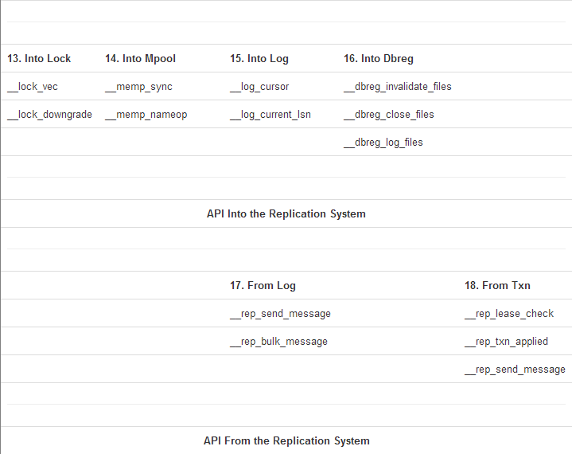

## Berkeley DB ##
Margo Seltzer and Keith Bostic  

康威定律说:"设计系统的组织，最终产生的设计等同于组织之内、之间的沟通结构。"。延伸一下，我们可以想象：初始由两个人设计的软件的架构，不仅仅反应了该组织间的结构，更反应了两个人之间的分歧与理念。我们两中的一个（Seltzer）的职业生涯都在从事文件系统和数据库管理系统。如果问她，她会说着两个东西从本质上讲其实是一回事。更进一步讲，操作系统和数据库管理系统本质上都是管理资源，并且提供抽象便捷的操作。它们的差异“仅仅”只是实现上的不同。另一个人（Bostic）则相信：基于工具的软件工程以及基于简单构件的组件架构。因为这样的系统在某些方面会比整体架构的系统要优秀的多--易理解性、可扩展性、可维护性、可测试性、灵活性。  

如果你结合两个观点，就不会惊讶于我们过去20年在Berkeley DB上的工作--一个软件库提供了快速，灵活，可靠并且可扩展的数据管理。Berkeley DB 提供了很多和传统系统一样的功能--人们期望的功能。比如，关系型数据库，但是，以不同的形式封装。比如，Berkeley DB访问数据很快，（key值访问和顺序访问），同样支持事务，崩溃恢复。但是，它是以库形式提供的，并且直接链接到应用程序中，而不是作为一个独立的应用服务。  

在本文中，我们会深入的剖析Berkeley DB（以下简称BDB），以及它的各个模块，每个模块都秉承了Unix的“do one thing well”的理念。内嵌了BDB应用可以直接使用这些组件，或者通过类似于get,put,delete数据项的操作来隐式的使用它们。我们关注于架构--我们如何开始，我们设计了什么，我们在哪结束，以及为什么。这些设计必须是（并且肯定是）可以适应和改变--随着时间的推移，重要的是维护原则以及一致性视角。我们也会简要的阐述一个长期软件项目的代码演变过程。BDB已经经过20年的持续开发，毫无疑问，这归功于一个优秀的设计。  

**1. In the Beginning**  
BDB可以追溯到Unix操作系统还是专属于AT&T的时代，数以百计的工具和库都有严格的许可限制。Margo Seltzer是California，Berkeley大学的毕业生， Keith Bostic是Berkeley计算机系统研究组的成员。那时候，keith真正致力于从Berkeley软件发行版上移除AT&T的软件。  

BDB项目开始的的目标是要替换 内存中hsearch hash package以及 磁盘上的dbm/ndbm hash package。使用一种新型改进的hash方法，可以应用于内存中和磁盘上。同时也是一个没有专属许可的自由发行版。Margo Seltzer写的这个hash库[SY91]是基于Litwin的《可扩展线性hash研究》。它使用一个很灵巧的方法使得能在固定时间内将hash值映射到数据页地址，同样可以处理大数据---数据项大于承载其的hash桶或者文件系统的页大小（通常是4到8个KB）。  

If hash tables were good, then Btrees and hash tables would be better（没看懂）。Mike Olson 同样是一名Berkeley大学的毕业生，之前写了很多BTree的实现，并且同意再写一个。我们中的三个将Margo的hash代码和Mike的转换成通用访问接口的API，应用通过此接口来操作数据库提供的hash或者BTree访问方法，继而来读取和修改数据。  

构建在这两种访问方式之上，Mike Olson 和 Margo Seltzer写了一篇论文 [SO92]，里面阐述了LIBTP，一种可以运行在应用程序地址空间的编程式事务型库。  

这个Hash和BTree库最终合入了4BSD的release版本中，并命名为Berkeley DB 1.85。技术上来讲，Btree访问方式是用B+link tree实现的，然而，在本文的接下来都会用BTree来指代。BDB 1.85的结构和API对于使用Linux或者基于BSD系统的人来说十分熟悉。  

BDB1.85库稳定了好几年，知道1996年，Netscape 签约了Margo Seltzer和Keith Bostic来构建出LIBTP论文中描述的完整事务系统。并且创建一个生产级别的软件版本。他们努力的结果就是BDB的第一个事务型版本，BDB2.0。  

BDB后来的历史就较为简单和传统了：BDB 2.0（1997）引入事务，DBD 3.0（1999）重新设计架构，添加了抽象层和间接的适应了不断增长的功能需求。BDB 4.0（2001）引入了备份和高可用性，以及Oracle BDB 5.0（2010）添加了SQL支持。  

在写这篇文章的时候，BDB已经是世界上使用最为广泛的数据库工具包了。数以百万计的拷贝运行在各种系统上，从路由，浏览器到邮箱和操作系统。经管已经过了20年，BDB的基于工具和面向对象的架构，使得它仍然可以继续改进以及自我重构来适应使用它的软件需求。  

**Design Lesson 1**  
对于任何一个复杂软件的测试和维护极为重要的是，软件在设计和构建时，就得设计成一系列模块的组合，并且定义好的API界限。这个界限可以（并且必须）根据需要改变，但是仍然需要这些界限。这些界限的存在，使得软件避免称为一堆不可维护的意大利面条。 Butler Lampson曾经说过，计算机科学中的所有问题可以通过另一种间接的层面解决。更为重要的是，当被问到面向对象意味着什么时，Lampson说，这意味着在一个API的背后你可以使用多种实现。BDB的设计和实现秉承了这一原则，在通用接口的之后运行多样的实现。提供面向对象的视角和感受，即使这些库是用C写的。  

**2. Architectural Overview**  
在本章节中，我们会回顾BDB库的架构，从LIBTP开始，讨论它的一些关键方面演进。  

图4.1，取自于 Seltzer 和 Olson的论文中，描述了原来的LIBTP架构，图4.2 描述了BDB2.0 的设计架构。  
  

LIBTP的实现和BDB 2.0的设计最大的不同就是移除了process manager。LIBTP要求各个控制线程注册自己，并同步于那些单独的线程/进程，而不是提供一个子系统级的同步。正如第4节讨论的，原始的设计可能更适用于我们。  

  

在设计和实际发布的db—2.0.6的架构（如图4.3）的不同之处在于，对于恢复模块的实现。图中灰色的部分就是恢复子系统。恢复模块包括了，驱动设备（图中的那个recovery方框）和一系列的redo,undo例程来恢复那些通过AM（access methond 访问接口）执行的操作。在架构图中就是那个标上“access method recovery routines”的圈。在BDB2.0中对于如何处理恢复是一致性设计，相对的LIBTB针对不同的访问接口使用不同的日志记录和恢复例程。这种通用的设计原则同样催生了不同模块间的丰富的接口。  

图4.4 描述了BDB-5.0.21的架构。该图所涉及到API列在表4.1中。尽管原来的架构仍然清晰可见，现在的架构添加了新的模块，分解了老的模块（比如，log变成了log和dbreg）,以及在模块间的API的数量上有很大的增加。  

经过十年的演讲，众多商用版本的发布，以及后续的数以百计的新特性，我们可以看到当前的架构比原来的复杂了好多。这边需要注意的是：首先，replication在系统中添加了一层，但是它处理的很干净，和原来的老代码一样，使用相同的接口和系统的其余模块交互。其次，log模块分裂成log和dbreg（数据库注册）。这在第8节会详细讨论。最后，我们将所有的内部模块调用放到命名空间中，并开头用下划线标识，这样应用就不会和我们的函数名冲突了。我们将会在 Design Lesson 6详细讨论。 

第四， 日志子系统的API目前是基于游标的（去除了log_get API,替换成了log_cursor API)。在历史上，BDB在任意时刻都不会有超过一个线程来读写日志，所以该库中有一个指向当前日志的指针。这不是一个很好的抽象，如果带上replication 就没法工作了。正如应用API使用游标支持迭代器，日志目前使用游标来迭代。第五，fileop模块内含的访问接口提供了事务性从保证了数据库的create,delete,rename操作。我们尝试多种方案来优雅的实现它（它仍没有我想象中那么干净），在对它重构了很长一段时间后，我们将它从模块中抽离出来。

**Design Lesson 2**  
软件设计是几种能让你尝试解决问题之前对其完整思考的方法之一。有经验的程序员会采用一些不同的技巧来完成设计：有些人会写出一个版本，然后丢弃它，有些人会写一些使用手册或者设计文档，others fill out a code template where every requirement is identified and assigned to a specific function or comment. 比如，对于BDB，在写代码之前，我们创建了一系列的Unix-style的使用手册，关于访问接口和组件。无论使用哪种技术，在调试代码之前，很难考虑清楚程序的架构到底是什么样的，更不用说，当架构发生大的变更时，之前的调试工作就白费了。Software architecture requires a different mind set from debugging code, and the architecture you have when you begin debugging is usually the architecture you'll deliver in that release. 

为何将事务库从组件中抽离出来，而不是像当初那样作为单一的用途？对于此问题有三种解释：  
1、它迫使一个更为严谨的设计。  
2、如果代码中没有较强的边界，软件包将欲将复杂最后沦为一坨意大利面条。  
3、你无法预料到所有用户的使用行为，如果你让用户可以访问软件组件，他们会用你从没想到的方式使用他们。  
在下面的章节，我们会讨论BDB的每一个组件，了解这个组件是做什么的，并在整个架构中如何发挥作用的。  

**3. The Access Methods: Btree, Hash, Recno, Queue**  
BDB的访问接口提供key值查找，迭代访问，变长和定长字节串。BTree和Hash支持变长key/value对。Recno和Queue支持记录号/值 对（Recno支持变长数据，Queue只支持定长数据）。  

Btree AM和Hash AM 最大的不同就是BTree支持key的局部引用，hash并不支持。这意味着，Btree成为访问数据集的首选，然而，Hash AM适用于数据集大到BTree索引都无法装入内存的情况。此时，将数据加载到内存就比加载索引到内存要好。在1990年，这种折衷意义很大，当时内存比现在要小的多。  

Recno和Queue的不同在于，Queue支持记录级的锁，代价就是只能支持定长数据。Recno支持变长对象，和Btree，Hash，一样，只支持页级锁。  

我们之前是如此设计BDB的：CRUD（create，read，update，delete）是基于key的，并且作为应用程序的首选。我们后续添加游标来支持迭代。我们这做导致库中有很多混乱的无用的重复的代码。随着时间推移，这变的越来越不可维护，然后我们将所有的key操作都变成游标操作（现在对key操作分配了一个缓存游标，执行操作，然后将游标归还给游标缓存池）。这是软件开发中的一个重述过无数次的规则：不要以任何会影响清晰性和简洁性的方式来优化代码，除非你确定必须要这么做。  

**Design Lesson 3**  
Software architecture does not age gracefully。软件架构的降级和对软件的修改量成正比：bug fixes corrode the layering and new features stress design。很难去判断当软件架构哦降级到何种程度，你就需要重新设计或者重写。一方面，随着架构的降级，维护和开发将变的越来越困难，结果就是对于这块遗留代码，每次发布的时候，都需要一堆人对其无脑测试，因为没人了解其内部是如何工作的。在另一个方面，用户会抱怨由于底层的变更所带来的不稳定性和不兼容性。作为一个软件架构师，你只能确保一件事：无论你怎么做，总会有人会抱怨你。  

我们没有详细讨论BDB AM的详细实现，他们是用耳熟能详的BTree和Hash算法实现的（Recno是在Btree加了一层，而Queue实现了一个文件块查找功能，复杂在增加了记录锁功能）  

**4. The Library Interface Layer**  
随着时间的推移，在添加功能的时候，我们发现应用和内部代码都需要统一的顶层功能（比如，一个表join的操作，需要多个游标来遍历记录，同样，应用也需要游标来遍历记录）  

**Design Lesson 4**  
如何命名你的遍历，接口，函数或者注释和代码风格都不重要。因为有大把好的风格可选。重要的是，命名和代码风格必须一致。有经验的程序员可以从代码风格和对象命名中获取很多信息。You should view naming and style inconsistencies as some programmers investing time and effort to lie to the other programmers, and vice versa. Failing to follow house coding conventions is a firing offense. 

因此，我们将几个访问接口API分解成几层。这些接口层执行了所有必要的错误检测，函数检测，接口跟踪，以及其他一些动作：比如自动事务管理。当应用调用BDB是，我们首先调用基于这些对象的接口例程。（比如，__dbc_put_pp，就是调用BDB游标“put”（用来更新数据）的接口调用）。我们用"_pp"后缀来定义那些应用可以调用的接口。  

接口层中有一项工作就是跟踪BDB中有哪些执行线程。这很重要，因为BDB中有些操作只有在没有执行线程时才可以执行。BDB对每个开始执行的线程打上标记，并在执行调用返回后清除标记。进入/退出检测通常在接口层执行，同样可以检测该调用是否要在一个复本中执行。  

一个明显的问题是“为何不把一个线程标识传到库中，这样不会更简单么？”，回答是"yes",这样做会更为简单，而且我们也希望我们能这么做。但这样的话，就需要改变每个使用BDB的应用，几乎对BDB所有应用层调用，很多情况下，需要对应用程序重新设计。  

**Design Lesson 5**  
系统架构师需要谨慎的考虑升级部分：升级到新的版本，用户可以接受次要的变更。（如果你能保证编译时错误，也就是说，升级完成后能有明显的错误，更新之后不能因为某些情况而导致崩溃）。但是要进行一次根本上的变更，你的架构必须允许新的代码，并且对你的用户群要留一个接口。显然，新代码和应用接口需要花费很多精力，但是就可以告诉用户这次大的变更是一次次要的变更，就不会惹怒你的用户群了。  

在接口层的另一个任务是事务处理。BDB提供一种模式：执行每个操作都会自动生成事务（这就省去了应用得创建和提交其显式事务的工作）。为了支持这一模型，每个通过该API的调用都会自动生成事务（如果没有明确指明其事务的话）。  

最后，所有的BDB AIP都需要检测参数。在BDB中有两类错误检测--通用检测来判断前一个操作的时候数据库是否崩溃了，或者我们是否正处于复制状态变更期（比如，改变复制器使之能写）。通用需要对某些API做特殊校验：flag使用，parameter 使用，option使用，以及在对请求的操作确切执行时的其他校验。  

对于API的校验函数都以“_arg”后缀。因此对于游标"put"的错误校验是在函数"__dbc_put_arg"中，由"__dbc_put_pp"函数调用。  

最后，当所有的参数校验以及事务生成都完成了，我们调用worker方法来执行实际的动作。（在我们的例子中，就是__dbc_put）。在我们内部调用游标put函数时也是用这个函数。  

This decomposition evolved during a period of intense activity, when we were determining precisely what actions we needed to take when working in replicated environments。在遍历了无数次代码库后，我们将所有的检测都抽离出来，这样下次有问题的时候，可以很容易的进行修改。

**5. The Underlying Components**  
有四个组件来访问接口：缓存组件，锁管理组件，日志组件，事务组件。我们接下来会分别讨论他们，但是他们仍有一些通用的架构设计。  

首先，所有的子系统都有其自己特有的API，并且，最初每个子系统都用自己的对象的句柄，所有对于该子系统的调用方法都基于此句柄。例如：你可以使用BDB的锁组件来处理你自己的锁，或者编写自己的远程锁组件。或者你可以使用BDB的缓存组件来处理你自己的在内存中的文件页。随着时间的推移，特定子系统的句柄从API中移除了，从而简便了基于BDB的应用。虽然子系统仍然作为独立组件，并独立于其他子系统使用，现在他们使用一个通用的对象句柄（“DB_ENV” 环境变量句柄）。这种架构促使了分层和泛化。尽管，分层随着时间移来移去，仍然有一些地方，一个子系统会跨越到另一个子系统，对于程序员来说这是一个很好的规则：将系统的某些部分作为独立的软件来考虑。  

第二，所有的子系统（实际上，所有的BDB函数）对于其调用都会返回一个错误码。作为一个库。BDB不能进入到应用的命名空间来定义一个全局变量，更不用说，所有的错误都从一个条路径返回给调用栈，这是一条很好的编程规则。  

**Design Lesson 6**  
在库设计的时候，使用命名空间是极为重要的。这样使用库的程序员就不需要记住一坨函数名，结构体，全局变量，来避免应用和库之间的命名冲突。  

最后，所有的子系统都支持共享内存。因为BDB支持多进程之间共享数据库，所有相关的数据结构都应放在共享内存中。这么做的最大的影响就是：在多进程环境中，内存中的数据结构都必须使用基地址+偏移，而不是使用指针。也就是说，不能直接通过指针来访问，BDB库必须使用基地址（这个地址是共享内存映射到程序中的地址）加上偏移量（数据结构在映射段中的偏移量）。为了支持这一功能，我们写了一个BDB的Queue发行包，其中实现一个通用的链表。  

**Design Lesson 7**  
在我们写共享内存链表之前，BDB必须手动编码访问共享内存中的数据结构，并且，这些代码是很脆落的而且难以调试。整合在BSD链表包（queue.h）中的共享内存链表包，包含了所有这些功能。一旦它通过了调试，我们就不需要调试其他共享内存链表上的问题了。这总结了三个设计原则：  
首先，如果你的某些函数出现了多次，写一个通用的方法，并使用它。因为只要代码中存在两个函数的拷贝，那么就会有一个是不正确的。  
第二、当你开发一系列通用例程时，对于这些例程写一些测试用例。这样你就能对这些例程单独调试了。  
第三、代码写的越复杂，越是要将其抽离出来编写和维护。保证一段代码不被周围的代码所影响是几乎不可能的。  

**6. The Buffer Manager: Mpool**  
BDB的Mpool子系统是一个文件页的内存缓存池，这就无需考虑有限的内存资源的问题。当数据库的大小大于缓存内存中的数据库页时，就需要对数据页进行换入换出，这就需要原来的hsearch和ndbm的实现能支持外存操作。  

虽然，BDB的BTree AM相当于传统的B+tree实现，页节点之间的指针使用页号来代替的，而不是实际的内存指针，因为库实现是对于磁盘上和内存中的页格式是一致的。这么写的优势在于，页可以从内存直接刷出，而不需要格式转换。缺点在于，遍历索引结构需要（费时的）重复对缓存池进行查找，而不是直接通过（快速的）内存直接定位来。

对于BDB的索引的内存实现实际上是对磁盘数据的缓存，这么做一些其他的性能影响。比如：当BDB访问缓存页是，它会在内存中订（pin）住该页。订住它后，就可以避免其他线程或者进程将其从缓存池中刷出。即使，索引结构都在缓存中，并不需要刷出到磁盘上，BDB仍然需要在每次访问的时候获取和释放这些pin,因为Mpool提供的实现模型是缓存而不是实际存储。  

**6.1. The Mpool File Abstraction**  
Mpool假定其处于一个文件系统之上，并从API中导出文件抽象。例如：“DB_MPOOLFILE”句柄表示一个磁盘上的文件，并提供了对文件的读写操作。BDB支持临时，纯粹的内存数据库，这些同样会被DB_MPOOLFILE引用，因为使用了Mpool抽象接口。“get”和“put”是Mpool API的主要方法：“get”确保该页处于缓存中，订住该页并返回该页的指针。当处理完页之后，put调用会unpin该页，释放其并刷出。BDB早期的版本，并不区分pin住某页去读还是pin住某页去写。然而，为了提高并行性，我们扩展了Mpool API运行调用者指示其对更新页的意图。这个将读访问和写访问区分出来对于多版本并行控制的实现很重要。pin住一个页来读，该页若是脏页就可以刷出到磁盘上。如果pin住该页是用来更新的，就不能刷出了。这会导致页的不一致。  

**6.2. Write-ahead Logging**  
BDB使用日志先行（WAL）作为其事务机制，从而可以从崩溃中恢复。Write-ahead Logging说明了在执行实际的数据更新之前，必须要将待操作的变更记录到磁盘上。BDB使用WAL作为其事务机制对Mpool有很重要的影响。Mpool设计时，必须在作为通用缓存机制和支持WAL协议之间平衡。  

BDB在所有的数据页上记录日志序列号（LSN）来记录对于某页的最新的一次变更。对于WAL支持需要在Mpool将页刷出到磁盘之前，它需要确保相应LSN的日志记录已经安全的写入到磁盘上了。这样的设计挑战在与如何提供此功能，而不需要所有使用Mpool的用户使用和BDB相同的数据页格式。Mpool通过提供一组set（和get）方法来支持这种行为。“DB_MPOOLFILE”方法“set_lsn_offset”提供了一个页上的字节偏移，标识了Mpool从哪去查找LSN来支持WAL，如果不调用此方法，就不需要支持WAL协议。类似的，set_clearlen方法告诉Mpool，在缓存中创建页时有多少字节（标识了元数据）需要显式清理。这些API使得BDB可以支持事务需求，而不需要所有的使用Mpool都得支持。  

**Design Lesson 8**  
日志先行是另一个封装和分层的例子，即使这些功能对于其他软件永远不会被用到：毕竟，有多少人会关心缓存中的LSN？除此之外，这种策略是很有用的，并且是的软件很容易维护，测试，调试和扩展。  

**7. The Lock Manager: Lock**  
和Mpool类似，锁管理组件是作为一个通用组件：一个层级锁组件（参见[GLPT76]），设计用来支持对层级对象加锁（比如独立的数据项），数据项所在数据页，数据项所在的文件，或者这一组文件。正如我们之前所描述的锁组件的功能：我们会阐述BDB是如何使用它们的。然而，和Mpool相同，需要注意的是，其他应用可能会用一个完全不同的方式来使用锁组件，并且这是可以的--该组件被设计成灵活的，支持多种用途的。  

锁组件有三个关键的抽象：“locker”标识了是谁想加锁，“lock_object”标识了待加锁的对象，还有一个“conflit matrix”  

Locker 是一个32-bit unsigned整型。BDB将这个32-bit空间划分成事务和非事务locker（尽管，不同的只是这块的实现是空的），当BDB使用锁组件是，对于非事务locker分配locker ID在0和0x7fffffff之间，对于事务locker分配0x80000000 和0xffffffff之间。比如，当应用打开数据库时，BDB需要对数据库获取一个长时间的读锁，从而确定其他控制线程不会在它使用时对其改名。这个产时间的锁就不属于事务，这个locker就是非事务型的。  

使用锁组件的每个应用都需要分配locker id，这样锁组件API可以通过DB_ENV->lock_id 和 DB_ENV->lock_id_free来确定死锁的locker。这样，应用就不需要实现他们自己的locker ID分配器，尽管他们当然也可以自己实现。  

**7.1. Lock Objects**  
锁对象是一串字节串，标识了待锁的对象。当不同的locker想锁住一个对象是，他们使用相同的字节串来引用该对象。也就是说，需要应用在对对象的字节串上达成一致。  

例如：BDB使用 DB_LOCK_ILOCK结构来表述其数据库锁。这个结构包含了3个字段：文件标识，页号和类型。  

在大多数例子中，BDB只需要说明其需要加锁的文件和数据页。BDB在数据库创建的时候会分配一个32-bit的数字串，并将其写入到数据库的元数据页中，并使用它作为Mpool，locking，longging子系统中的唯一标识。就是DB_LOCK_ILOCK中的filed字段。毫无疑问，页号标识了我们想锁的数据页。当我们使用页锁是，我们将该结构中的type字段设置为 DB_PAGE_LOCK。然而，我们也可以锁住其他对象。DB_RECORD_LOCK 类型使我们可以以一种队列访问模式下执行纪录锁，DB_DATABASE_LOCK类型使我们可以锁住整个数据库。  

**Design Lesson 9**  
BDB使用页级锁是有原因的，但是我们发现有时候会有问题。页级锁限制了应用的并发度，如果有一个线程在对数据页做修改，会阻塞其他线程对数据页上的其他记录做修改，然而记录级锁可以支持对同一页的不同记录并行修改。页级锁提升了稳定性，因为其限制了恢复路径数。（某个页在恢复时只会有几种固定的状态，而不是无限可能的状态，如果条记录从页中新增和删除）。由于BDB是作为嵌入式系统，所以在系统崩溃时，就没有数据库管理员来手动修改，所以我们选择了稳定性而不是提升并发度。  

**7.2. The Conflict Matrix**  
锁子系统的最后一个抽象是冲突矩阵。一个Conflict Matrix定义系统中的不同的锁，他们之间如何交互的。我们称之为一个持有锁的实体为持有者(holder)，以及请求锁的实体为请求者(requestor)，假设holder和requester为不同的loker id。冲突矩阵是一个数组，通过[requester][holder]来索引，如果没有冲突，该entry就为0，表示可以获得锁，如果有冲突，表示不能获取锁。  

锁管理组件包含了一组默认冲突矩阵，这也正是BDB锁需要的，然而，应用可以自由的设计其锁模型以适应其自身的需求。对于冲突矩阵的上的唯一要求就是其方阵（行列数目相同），并且应用使用0-based的序号值来描述锁模型（比如，读，写），表2就是BDB的冲突矩阵。

  

**7.3. Supporting Hierarchical Locking**  
在解释BDB冲突矩阵的不同锁模型之前，我们先来说一说锁子系统所支持的层级锁。层级锁是一种可以在一个层次结构内锁住同对象的方法。比如，文件包含数据页，数据页包含数个元素。当在层级锁系统中修改某个页元素时，我们想仅仅锁住这个对象。如果我们锁住了这个页的所有元素，就可以简单的锁住这个页。如果我们想修改一个文件中的所有页，我们就可以锁住整个文件。另外，层级锁必须知晓这些容器的层级结构，因为对页加锁从某种角度也对文件加锁了。你没法在一个页在修改时，修改这个文件。  

关于如何不同的locker如何对层级锁加锁，而不会导致混乱。答案就是意向锁。locker在容器上加意向锁，表示想对该容器中的东西加锁。所以获取页上的读锁，意味着就要获取文件上的意向读锁。类似的，想要修改页，就必须同时获取到页和文件的意向写锁。在上述的冲突矩阵中，iRead,iWrite,iWRd都是意向锁，各自表示意向读，意向写，意向读写。  

因此在执行层级锁是，并不是对某个东西加锁，需要获取一系列的锁：某个实体上的锁以及其容器上的意向锁。这就需要调用到BDB的DB_ENV->lock_vec接口。它可以接受一获取锁请求，然后获取它们（或者拒绝）。  

尽管，BDB内部不使用层级锁，它仍然利用其优点来指定不同的冲突矩阵，以及可以同时锁住多个锁。我们使用默认冲突矩阵来提供事务支持，使用另一套冲突矩阵来提供简单的并发访问（无事务）以及支持崩溃恢复。使用DB_ENV->lock_vec来执行锁耦合，一种可以增强Btree遍历的方法 [Com79].。在进行锁耦合是，持有一个锁足够长的时间，只为了获取下一个锁。也就是说，你锁住一个Btree页读取其信息后就释放，使用该信息可以确定下一层需要锁定的锁。  

**Design Lesson 10**  
BDB的通用设计同样有助于我们添加并行数据处理功能。开始的时候，BDB只提供了两种操作模式：要么你以无并行写方式执行，要么全部使用事务。对事务的支持，增加了开发人员的编程复杂度。并且，我们发现某些应用想提高并行度，但不想全量支持事务。为了支持这种功能，我们添加API级别的锁来支持这种并发，同样保证了没有死锁。这就需要一种全新的锁模型，并能工作在当前游标下。我们没有对锁模块添加额外的代码，我们只是创建了另一个可选锁矩阵来支持API级锁需求。因此，通过简单的配置锁组件，我们就可以提供我们需要的锁。（不幸的是，改变AM并不那么简单，仍然需要对AM进行很多变更来处理这种特殊的并行访问。）  

**8. The Log Manager: Log**  
日志组件提供了一种结构化的追加式的文件抽象。和其他模块一样，我们想设计一种通用的日志组件，然而，日志子系统可能至少是一个成功的模块。  

**Design Lesson 11**  
如果你发现有些架构问题，你“目前”不想解决，并且想先放一放，remember that being nibbled to death by ducks will kill you just as surely as being trampled by elephants，当需要改变整个架构来改进系统的时候，不要太过犹豫，如果你做了变更，就不要只做一部分，然后想着以后再完善它--要继续完成它！。正如经常强调的：“如果你现在没时间做，以后更没时间做”，并且，如果你变更了框架，请同样写好一个测试架构。

一个日志原理上是很简单的：它处理字节串，顺序的写入文件，并分配一个唯一的标识符（称为日志序列号:LSN）。另外，日志必须提供高效的前后遍历功能（通过LSN）。有两个难点：首先，日志必须其在崩溃后是处于一致的状态（一致的意思是它包含了连续的干净的日志记录），其次，因为日志记录在事务提交时，需要写入持久化存储，所以日志的性能通常会影响到事务应用的性能。  

由于日志是一种追加式的数据结构，它可以无限制的增长。我们将日志实现成一组顺序标号的文件，这样就可以通过简单的删除老的日志文件来释放空间。考虑到日志的多文件架构，我们将LSN作为文件号的一部分，以及其在文件中的偏移量。因此通过LSN，日志组件就能定位到这条记录，它偏移到指定文件的指定位置，读出这条记录。但是日志组件怎么知道该读取多少字节呢？  

**8.1. Log Record Formatting**  
日志的每个记录都必须记录元数据。这样通过指定的LSN，日志组件就可以确定应该返回的记录大小。至少，它需要知道记录的长度。我们预先在每个日志记录前加一个日志记录头，其中包含了该记录的长度，前一条记录的偏移（为了支持向后遍历），以及这个日志记录的校验和（用来标识该日志损坏了，以及到了日志文件尾）。日志组件使用元数据足以维护日志记录的序列，但是这对恢复来说并不足够。要实现恢复，就要靠日志记录的内容了，以及BDB如何使用这些日志记录。  

BDB使用日志组件来记录数据修改之前和修改之后（在实际更新数据库中的数据项之前[HR83]），这些日志记录包含而来足够信息来对数据库做redo或undo操作。BDB在事务中止（也就是说，当事务取消后，对该事务所做的所有操作都要undo）,以及崩溃后恢复，都会使用这些日志。  

除了关于读写日志的API，日志组件还提供了API来刷出日志记录到磁盘（DB_ENV->log_flush）。这使得BDB可以支持日志先行--在页从Mpool刷出之前，BDB检测该页的LSN，并通知日志组件，确保这个LSN的日志已经持久化了。只有在这之后，Mpool才会将页刷出到磁盘上。  

**Design Lesson 12**  
Mpool和日志使用内部句柄函数来实现日志先行功能，并且在某些情况下，函数声明比要执行的代码还要长，有些代码只是比较整型值，其他啥都不做。为啥要担忧这些不重要的函数呢，只是为了维持分层的一致性？因为如果你的代码并不足够面向对象，这会让人牙疼。每段代码都必须要做一些少量的事情，这种高层设计促使程序员构建更小的功能模块等的呢过。如果有什么事情我们在过去几十年的软件开发中所学到的，那就是我们很难去构建和维护软件的重要模块。构建和维护软件的重要部分是很困难的，容易出错的，并且作为一个软件架构师，你必须尽力做，尽早做，经常做，来扩充你的软件架构所要传达的信息。  

BDB在日志记录上加上这些结构以便于恢复。大多数BDB日志记录描述了事务型的更新。因此，大多数日志记录对应了某个事务对数据库页的修改。这种描述提供了最基本的信息，使得BDB得以确定需要从每个日志记录中获取的元数据：数据库，事务，记录类型。事务表示和记录类型字段处于每个记录的相同的位置。这就使得恢复系统可以抽离记录类型并且将记录分发给相应的处理句柄来解析日志记录，并做相应的处理。事务标识使得恢复进程可以标识出每个日志记录属于哪个事务，这样对于不同的恢复场景，就可以知道该记录是要忽略还是执行。  

**8.2. Breaking the Abstraction**  
另外还有一种特殊的日志记录。Checkpoint 记录可能是最熟知的特殊记录了。Checkpointing进程是用来保证数据库在磁盘上的数据在某一时刻的一致性状态。也就是说，BDB扩大Mpool的缓存页来提供性能。然而，这些页必须周期性的刷出到磁盘，刷的越频繁，我们在崩溃恢复的时候就会越快。这就需要在检测点的频度和恢复耗时之间做个权衡：系统执行checkpoint越频繁，恢复的就越快。checkpoint是一种事务型功能，所以我们会在下一节详细描述checkpointing。在本节中，我们会讨论checkpoint记录，以及日志组件是如何在权衡的：作为一个独立组件还是作为BDB的特有模块。  

通常，日志组件本身并没有记录类型的概念，因此原则上它并不区分checkpoint记录和其他记录--他们都只是字符串，日志组件会将他们刷出磁盘上。实际上，日志中的元数据可以使其了解一些记录的内容。比如，在日志启动时，日志组件会检验所有的日志文件，它可以找出最近一次写入的日志文件。也就是说这个文件之前的所有的日志文件都是完好的，接着就校验这个最近的日志文件，并判断出有多少有效日志记录。它从日志头开始读，直到碰到一个不正确的checksum,这就表示剩余的日志记录都损坏了。也就是说，它确定了日志的逻辑结束点。  

在处理日志并找出终止点时，日志组件会抽出BDB日志记录，查找checkpoint记录。它记录下最后一次checkpoint记录的位置，并作为该事务系统的一个“favor”。也就是说，事务系统需要查找最后一次checkpoint，但并不是说要让日志组件和事务组件去遍历所有的日志文件，事务组件将这个任务教育日志组件完成。这是一个典型的违反抽象边界的例子，但是换来的性能的提高。  

影响权衡的因素是什么呢？设想一下BDB以外的系统使用日志组件。如果它恰好在BDB写checkpoint记录类型的地方写东西，那么日志组件就认为这个记录是一条checkpoint记录。然而，除非应用向日志组件询问这些信息（比如直接访问日志元数据中的cached_ckp_lsn）,这类信息不会影响任何东西。简而言之，这是一个违反分层的做法，也是一个精明的性能优化。  

文件管理组件是另一个日志组件和BDB界限很模糊的地方。正如之前提到的，大多数BDB日志记录需要标识其数据库。每个日志记录可能都包含数据库的全名，但是这会浪费很多日志空间，并且相当笨拙。因为恢复的时候会将这个名字映射到某个句柄上，使用它可以访问数据库（要么文件描述符，要么数据库句柄）。然而，取而代之的是BDB用一个整数标识了数据库，我们称之为日志文件ID，并且实现了一系列的方法，叫做dbreg（“数据库注册”），用来维护文件名和日志文件ID之间的映射。这种映射的一致性版本（记录类型为 DBREG_REGISTER）当数据库打开的时候会写入到日志记录中。然而，我们同样需要在内存中装载这种映射，来方便事务中止和恢复。哪个子系统来维护这个映射呢？  

原则上，文件和日志文件ID的映射是BDB的高层功能。它并不属于任何一个子系统，这些子系统对这种视图一无所知。在原来的设计中，该信息是维护在日志子系统的数据结构中，因为日志系统似乎是最好的选择。然而，在对这一实现不停的调试和修复后，这种映射支持就从中抽离了出来，并放到一个小型子系统中，并使用其自己的面向对象的结构，以及私有的数据结构。（回顾来看，这种信息应该逻辑的放置在BDB自身的环境信息中，在所有子系统之外）。  

**Design Lesson 13**  
很少说有个不重要的bug。当然， there's a typo now and then，但是通常一个bug说明了某人并没有完全理解他们正在写的东西，并且实现错了。当你修复一个bug的时候，不要关注于症状：关注这个bug发生的环境，以及误区，如果你这么做了，可以使你更好的理解这个程序的架构，并且可以揭示其设计本身的缺陷。  

**9. The Transaction Manager: Txn**  
我们讨论的最后一个模块是事务管理，它和其他组件一起提供了事务的ACID特性（atomicity, consistency, isolation, and durability）。事务组件负责事务的开始和完成（提交或者中止），相应的，日志和缓存组件执行事务checkpoint，以及为恢复做准备。我们接下来会一个个的来讨论。  

Jim Gray发明了ACID的缩写来描述事务的特性 [Gra81]。Atomicity表示所有事务下的操作是作为一个单位来执行--他们要么全部执行成功要么全部失败。Consistency表示事务将数据库从一个逻辑一致的状态到另一个状态。比如：如果应用指定所有的雇员必须被分配数据库中的一个部门，Consistency就能保证保证这一操作（当然要使用事务）。Isolation 表示从事务的角度来看，事务运行的时候就好像没有其他事务在同时运行。最后，durability意味着一旦事务提交了，它就是提交了，任何错误或崩溃都不会导致这次提交的操作丢失。

事务组件通过其他组件的支持来提供ACID特性。它使用传统的事务操作，begin, commit, abort来划定一个事务的起始和结束点。它也提供了prepare调用，这以便于两段式提交，这种技术可以保证分布式事务中的事务特性，本文中不做详细讨论。事务begin时会分配一个新的事务表示，并且返回给应用一个事务句柄，DB_TXN。事务commit时会写一个commit日志记录，然后强制日志刷出到磁盘上（除非应用明确指出它要放弃持久性来换取提交性能。），这样就能确保发生崩溃时，事务也可以提交。事务abort，回溯该事务的日志记录，undo每个操作，并返回到执行该事务之前的数据库状态。  

**9.1. Checkpoint Processing**  
事务组件同样要负责执行checkpoint。在这篇论文中 [HR83]有很多不同的执行checkpoint的技术。BDB使用一种模糊checkpoint的变种。从根本上说，checkpointing触发了将缓存从Mpool刷出到磁盘上。这是一个很耗时的操作，重要的是系统在这么做的时候还得处理新事务，从而避免长时间的服务中断。在checkpoint开始是，BDB校验当前的所有事务找到一个他们中的最小的一个LSN,这个LSN就是chekcpoint LSN。事务组件通知Mpool刷出脏页到磁盘上，缓存的刷出可能触发日志刷出操作。在所有的缓存都持久化到磁盘上后，事务组件会写一条chekcpoint日志记录，该记录包含了这个checkpoint LSN。这条记录标识了，所有这个LSN之前的所有日志记录都已经持久化到磁盘上了。因此，LSN之前的日志记录就无需再回复了。这会有两个影响：首先，系统可以回收该checkpoint LSN之前的所有日志文件。其次，回复的时候只需要处理checkpoint LSN之后的日志记录，因为 checkpoint LSN 之前的日志记录以及更新到了磁盘上了。  

需要注意的是，在checkpoint LSN和真实的checkpoint 记录之间可能会有很多日志记录。这是可以的，由于这些记录逻辑上来讲是发生在checkpoint之后的，所以如果系统崩溃了，这些日志记录也需要恢复的。  

**9.2. Recovery**  
关于事务的最后一块拼图就是recovery。recovery的目标是磁盘上的数据库从非一致状态恢复到一致的状态。BDB使用一种很简单的两段式模型，“参照最后一次checkpoint LSN，undo所有没有提交的事务，redo那些已提交的事务”，还有一些复杂的细节。  

BDB需要重建日志文件ID和实际的数据库之间的映射。这样它就可以对数据库做redo，undo操作了。日志中包含了DBREG_REGISTER的所有历史记录，但是由于数据已经open了好长一段时间，我们不想分析数据库开始以来的所有日志文件。我们想以一种更为高效的方式来访问这个映射。在写checkpoint记录之前，事务组件会写一组DBREG_REGISTER记录来描述当前的日志文件ID和数据库的映射关系。在恢复的时候，BDB使用这个日志记录来重建文件映射。  

当恢复开始时，事务组件使用日志组件的cached_ckp_lsn值来确定日志的最后一个checkpoint记录的位置。这个记录包含了checkpoint LSN。BDB需要从checkpoint LSN开始恢复，但是为了能这么做，他就需要重建在checkpoint时刻的日志文件ID的映射，而这一信息是存于checkpoint LSN之前的记录中。因此BDB需要查找最后一个checkpoint之前的日志。checkpoint记录中不仅仅包含checkpoint LSN，也包含了之前一个checkpoint LSN，以便这些处理。恢复起始于最近一次的checkpoint，并使用pre_lsn字段，向后遍历日志知道找到在这个checkpoint LSN之前的checkpoint记录。算法如下：  

ckp_record = read (cached_ckp_lsn)
ckp_lsn = ckp_record.checkpoint_lsn
cur_lsn = ckp_record.my_lsn
while (cur_lsn > ckp_lsn) {
ckp_record = read (ckp_record.prev_ckp)
cur_lsn = ckp_record.my_lsn
}  

用这个算法挑选出的checkpoint开始，recovery顺序读取日志文件，并重建日志文件ID映射。当它读完所有日志时，这个映射应该和系统停止时的的映射完全一致。同样在这次遍历的是，recovery跟踪每一个事物的提交记录，记下这些事务标识。任何一个出现在日志中的事务，但是没有提交日志记录的都认为是中止的或者根本没有完成的（都被认为是中止的）。当recovery读完日志后，它掉头开始回溯日志。对于遇到的每个事务日志记录，它抽离出事务标识，并判断这个事务是否已经提交，继而判定这条记录是否要undo。如果它发现这个事务标识并不是已提交的事务，它会抽出记录类型并调用recovery例程来处理这个记录，直接undo这个操作。如果这条记录属于已提交的事务，recovery在这次回溯遍历中会忽略她。回溯遍历直到checkpoint LSN。最后，recovery最后一次向前遍历日志，这一次会redo所有已提交的事务日志记录。当最后一个遍历完成是，recovery执行了checkpoint。在这一时刻，数据库是完全一致的，并且可以运行应用了。  

因此，恢复流程可以总结如下：  
1、找到最后一次checkpoint的checkpoint LSN指向的checkpoint。
2、向前读取日志文件，构建日志文件ID映射和已提交事务的列表。
3、向后读取日志文件直到checkpoint LSN，undo所有未提交的事务的操作。  
4、向前读取日志文件，redo所有已提交的事务操作。  
5、执行checkpoint。  

原理上讲，最后一次checkpoint是没有必要的。但是事实上，这对以后的恢复节省了时间，并保证数据处于一致性状态。  

**Design Lesson 14**  
数据库恢复是一个很复杂的话题，难以编码和调试，因为恢复不是经常发生。n his Turing Award Lecture, Edsger Dijkstra argued that programming was inherently difficult and the beginning of wisdom is to admit we are unequal to the task.我们作为架构师，程序员的目标是，可以使用现有的工具来：设计，问题分解，审查，测试，命名和风格约束，以及其他一些好习惯，将问题限制在我们可以解决的领域内。  

**10. Wrapping Up**  
BDB以及发展了20余年。按理说，它是第一代通用的事务型key/value存储，并且是NoSQL运动的始祖。BDB一直作为存储系统使用在，数以百计的商业系统，数以千记的开源软件（包括SQL，XML，NoSQL引擎），全球有数百万的应用部署。从它的开发和维护中我们所学到的东西都在上面总结了出来。我们希望其他软件设计者和架构师们能从中受益。

    

